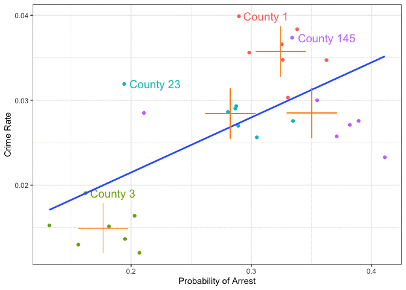

```{r setup, include=FALSE,warning=FALSE,message=FALSE}
options(htmltools.dir.version = FALSE)
knitr::opts_chunk$set(
  message = FALSE,
  warning = FALSE,
  dev = "svg",
  cache = TRUE,
  autodep = TRUE,
  fig.align = "center"
  #fig.width = 11,
  #fig.height = 5
)

# define vars
om = par("mar")
lowtop = c(om[1],om[2],0.1,om[4])
library(magrittr)

library(data.table)
gofmap = data.table(modelsummary::gof_map)
gofmap[,omit := TRUE]
gofmap[clean == "R2", omit := FALSE]

# Load here every package used in inline R code (`r ...`) on the slides.
# This chunk always runs; library() calls inside *cached* chunks are skipped
# when the cache is reused, which breaks knitting in RStudio.
# (after data.table, as before, so dplyr's first()/last()/between() win)
library(dplyr)
library(ggplot2)
library(fixest)

```

```{css, echo = FALSE}
/* two-column helpers: these live in css/scpo.css, which this deck does not load */
.left-wide  { width: 70%; float: left; }
.right-thin { width: 25%; float: right; }
.right-wide { width: 70%; float: right; }
.left-thin  { width: 25%; float: left; }
.smaller    { font-size: 85%; }
```


# Where We Are, and Why Panel Data

.pull-left[

## Where we are

* We can now estimate regressions **and** quantify their uncertainty: standard errors, confidence intervals, p-values.

* But a very *precise* estimate of a *biased* coefficient is still biased. The big threat is **omitted variable bias**.

* Controlling for observed variables only gets us so far. What about **unobserved** confounders?

]

.pull-right[

## Today

* **Panel data**: the *same units* observed *repeatedly over time*.

* If the unobserved confounder **does not change over time**, we can difference it out by comparing each unit **to itself**.

* This is the idea behind **fixed effects**.

]

---

# Today's Lecture

1. What is panel data? Cross-section vs. panel

1. Why it helps: *within* vs. *between* variation

1. Fixed effects, three equivalent ways: dummies, first differences, within transformation

1. Fixed effects in `R` with `fixest`: unit and time effects, clustered standard errors

1. What fixed effects can **and cannot** do

## Why this matters

* Panel data and fixed effects are the workhorse of applied micro: many of your **final projects** will use them.

* They are the building block of **Difference-in-Differences**, which comes up after RDD: in its simplest form, DiD is a regression with unit and time fixed effects plus a treatment indicator.

---

# Type of Data #1: Cross-Sectional

.pull-left[
So far, we have generally dealt with data that looks like this:

```{r,message=FALSE,warning=FALSE,echo = FALSE}
library(dplyr)
library(ggplot2)
data(crime4,package = "wooldridge")
crime4 %>%
  filter(year == 81) %>%
  arrange(county,year) %>%
  select(county, crmrte, prbarr) %>%
  rename(County = county,
         CrimeRate = crmrte,
         ProbofArrest = prbarr) %>%
  slice(1:5) %>%
  knitr::kable(align = "ccc", format = "html")
```
]

.pull-right[

* We have a unit identifier (like `County` here),

* Observables on each unit.

* Usually called a **cross-sectional** dataset

* Provides single snapshot view

* Each row, in other words, is one *observation*.
]


---

# Type of Data #2: Panel

```{r, include = FALSE}
n_cty = n_distinct(crime4$county)
n_yr = n_distinct(crime4$year)
```

.pull-left[
Now, let's add a `time` index: `Year`.

```{r,echo = FALSE}
crime4 %>%
  select(county, year, crmrte, prbarr) %>%
  arrange(county,year) %>%
  rename(County = county,
         Year = year,
         CrimeRate = crmrte,
         ProbofArrest = prbarr) %>%
  slice(1:9) %>%
  knitr::kable(align = "ccc", format = "html")
```
]

.pull-right[

* Next to the unit identifier (`County`, $i$) we now have `Year` ($t$)

* A pair (`County`,`Year`) indexes one observation: we write $y_{it}$

* We call this a **panel** or **longitudinal** dataset

* We can track units *over time*.

* Our data: `r n_cty` counties $\times$ `r n_yr` years = `r n_cty * n_yr` county-years. Every county is observed in every year: a **balanced** panel.

]


---

# Crime Rates and Probability of Arrest

* The above data can be loaded with
    ```{r, eval = FALSE}
    data(crime4,package = "wooldridge")
    ```

* They are from [C. Cornwell and W. Trumbull (1994), “Estimating the Economic Model of Crime with Panel Data”](https://www.amherst.edu/media/view/121570/original/CornwellTrumbullCrime%2BElasticities.pdf).

* One question here: *how big is the deterrent effect of law enforcement*? If you know you are more likely to get arrested, will you be less likely to commit a crime?

--

* This is tricky, for two different reasons. **Challenge 1: reverse causality.** Does high crime *cause* stronger police response, which acts as a deterrent, or is crime low because deterrent is strong to start with?

* This is sometimes called a *simultaneous equation model* situation: police response impacts crime, but crime impacts police response

\begin{align}
police &= \alpha_0 + \alpha_1 crime \\
crime &= \beta_0 + \beta_1 police
\end{align}

* Panel data will **not** solve this one (we come back to this at the end of the lecture). Today we focus on a second challenge.


---

# Crime Rates and Probability of Arrest

.pull-left[

**Challenge 2: unobserved heterogeneity.**

* Most literature prior to that paper estimated simultaneous equations off cross sectional data

* Cornwell and Trumbull are worried about **unobserved heterogeneity** between jurisdictions: counties differ in many persistent ways we cannot measure.

* Why? What could possibly go wrong?

]
--
.pull-right[

* Let's pick out 4 counties from their dataset

* Let's look at the crime rate vs probability of arrest relationship

* First *pooling* all county-years together, ignoring which county they come from

* Then taking advantage of the panel structure (i.e. each county over time).

]


---

# Crime vs Arrest: Pooling All County-Years

.pull-left[

*What to do*: subset data to 4 counties (7 years each = 28 observations), then plot probability of arrest vs crime rate.

*Pooled OLS* stacks all county-years together as if they were 28 unrelated observations.

```{r crime1,echo = TRUE, eval = FALSE}
css = crime4 %>%
  filter(county %in% c(1,3,145,23))

ggplot(css, aes(x = prbarr, y = crmrte)) +
  geom_point() +
  geom_smooth(method = "lm", se = FALSE) +
  theme_bw() +
  labs(x = "Probability of Arrest",
       y = "Crime Rate")
```
]

.pull-right[
```{r,echo = FALSE,fig.height=5}
css = crime4 %>%
  filter(county %in% c(1,3,145, 23))  # subset to 4 counties

ggplot(css,aes(x =  prbarr, y = crmrte)) +
  geom_point() +
  geom_smooth(method="lm",se=FALSE) +
  theme_bw() +
  labs(x = 'Probability of Arrest', y = 'Crime Rate')
```
]

---

# Pooled OLS: A Positive Relationship!

.pull-left[

* We see an upward sloping line!

* Higher probability of arrest is associated to higher crime rates.

* How strong is the effect?
]

.pull-right[
```{r}
pooled_fit = lm(crmrte ~ prbarr, css)
coef(pooled_fit)[2]  # gets slope coef
```

```{r,echo = FALSE}
pooled_p = round(predict(pooled_fit,newdata = data.frame(prbarr = c(0.2,0.3))),3)
```

* Increasing the probability of arrest by 1 unit (i.e. 100 percentage points) is associated with a `r round(coef(pooled_fit)[2], 3)` higher crime rate (crimes per person).

* A more realistic change: an increase of 10 percentage points in the probability of arrest (e.g. `prbarr` goes from 0.2 to 0.3) is associated with an increase in crime rate from `r pooled_p[1]` to `r pooled_p[2]`, or a `r round(100 * diff(pooled_p) / pooled_p[1],2)` percent increase in the crime rate.

]

---

# Ok, but what does that *mean*?


* Literally: counties with a higher probability of being arrested also have a higher crime rate.

* So, does it mean that as there is more crime in certain areas, the police become more efficient at arresting criminals, and so the probability of getting arrested on any committed crime goes up?

* What does police efficiency depend on?

* Does the poverty level in a county matter for this?

* The local laws?

* 🤯 wow, there seem to be too many things left out of this simple picture.


---

# Crime in a DAG (Directed Acyclic Graph)

```{r cri-dag,echo = FALSE,message = FALSE,fig.height=5.1}
library(ggdag)
coords <- list(
    x = c(ProbArrest = 1,LawAndOrder = 1, Police = 1.5, CivilRights = 3,Poverty = 3, CrimeRate = 5, LocalStuff = 5),
    y = c(ProbArrest = 1,LawAndOrder = 4, Police = 2.5, CivilRights = 2,Poverty = 4, CrimeRate = 1, LocalStuff = 4)
    )
dagify(CrimeRate ~ ProbArrest,
       CrimeRate ~ LocalStuff,
       CrimeRate ~ Poverty,
       CrimeRate ~ CivilRights,
       ProbArrest ~ LocalStuff,
       Poverty ~ LocalStuff,
       ProbArrest ~ Poverty,
       ProbArrest ~ LawAndOrder,
       ProbArrest ~ Police,
       ProbArrest ~ LawAndOrder,
       CivilRights ~ LawAndOrder,
       Police ~ LawAndOrder,
       labels = c("CrimeRate" = "Crime Rate",
                  "ProbArrest" = "ProbArrest",
                  "LocalStuff" = "LocalStuff",
                  "Poverty" = "Poverty",
                  "Police" = "Police",
                  "CivilRights" = "CivilRights",
                  "LawAndOrder" = "LawAndOrder"
                  ),
       exposure = "ProbArrest",
       outcome = "CrimeRate",
       coords = coords) %>%
  ggdag(text = FALSE, use_labels = "label") + ggtitle("What causes the Crime Rate in County i?") + theme_dag()
```

```{css, echo = F}
.reduced_opacity {
  opacity: 0.2;
}
```

---

# Crime in a DAG

.left-wide[
**Fixed Characteristics**: vary by county, but *not* over time
* `LocalStuff` are things that describe the County, like geography, and other persistent features.
* `LawAndOrder`: commitment to *law and order politics* of local politicians
* `CivilRights`: how many civil rights you have


**Time-varying Characteristics**: vary by county and by year
* `Police` budget: an elected politician has some discretion over police spending
* `Poverty` varies with economy
]

---

# Within and Between Variation

You will often hear the terms *within* and *between* variation in panel data contexts.

.pull-left[

## Within Variation

* How a unit's values change **relative to its own average**, over time

* Here: police budgets and poverty levels move up and down *within* each county from year to year.

]

.pull-right[

## Between Variation

* How units differ **from each other**, in their averages

* Things that are **fixed** over time (`LocalStuff`, `LawAndOrder`, `CivilRights`) can *only* vary between counties.

]

Every observation splits into a *between* part and a *within* part:

$$x_{it} = \underbrace{\bar{x}_i}_{\text{between: unit's average}} + \underbrace{(x_{it} - \bar{x}_i)}_{\text{within: deviation from own average}}$$

---
background-image: url("https://media.giphy.com/media/3oKIPlLZEbEbacWqOc/giphy.gif")
background-position: 95% 50%
background-size: 300px

# Within and Between Variation: Give us a Plot.

.left-wide[
```{r,echo = FALSE,message = FALSE,fig.height = 4.7}
pcolor = css %>%
  group_by(county) %>%
  mutate(label = case_when(
    crmrte == max(crmrte) ~ paste('County',county),
    TRUE ~ NA_character_
  ),
  mcrm = mean(crmrte),
  mpr = mean(prbarr)) %>%
  ggplot(aes(x =  prbarr, y = crmrte, label = label)) +
  geom_point(aes(color = factor(county))) +
  theme_bw() +
  geom_smooth(method = "lm", se=FALSE) +
  labs(x = 'Probability of Arrest',
       y = 'Crime Rate',
       color = "County")
pcolor
```
]


---

# Between Variation: Regressing the County Means

* Let's add the mean of `prbarr` and `crmrte` for each of those counties to the scatter plot!

* And then a regression through those 4 points: this uses *only* between variation.


```{r,echo = FALSE,fig.height = 4.2,warning = FALSE,message = FALSE,fig.width=10}
p1 = css %>%
  group_by(county) %>%
  mutate(label = case_when(
    crmrte == max(crmrte) ~ paste('County',county),
    TRUE ~ NA_character_
  ),
  mcrm = mean(crmrte),
  mpr = mean(prbarr)) %>%
  ggplot(aes(x =  prbarr, y = crmrte, label = label)) +
  geom_point(aes(color = factor(county))) +
  theme_bw() +
  # geom_smooth(method = "lm", se=FALSE) +
  scale_x_continuous(limits = c(0.1,0.43)) +
  scale_y_continuous(limits = c(0.01,0.041)) +
  labs(x = 'Probability of Arrest',
       y = 'Crime Rate',
       color = "County")  +
  # scale_color_manual(values = c('black','blue','red','purple'))
  geom_point(aes(x = mpr, y = mcrm,color = factor(county)), size = 20, shape = 3) +
  annotate(geom = 'text', x = .3, y = .02, label = 'Means Within Each County', color = 'darkorange', size = 14/.pt) +
  guides(color = FALSE, labels = FALSE)


p2 = css %>%
  group_by(county) %>%
  mutate(label = case_when(
    crmrte == max(crmrte) ~ paste('County',county),
    TRUE ~ NA_character_
  ),
  mcrm = mean(crmrte),
  mpr = mean(prbarr)) %>%
  ggplot(aes(x = mpr, y = mcrm)) +
  theme_bw() +
  geom_smooth(method = "lm",se = FALSE) +
  geom_point(size = 20, shape = 3, aes(color = factor(county))) +
  scale_x_continuous(limits = c(0.1,0.43)) +
  scale_y_continuous(limits = c(0.01,0.041)) +
  labs(x = 'Probability of Arrest',
       y = 'Crime Rate') +
  guides(color = FALSE, labels = FALSE)
cowplot::plot_grid(p1,p2,align = "v")

```

---

```{r, include = FALSE}
county_means = css %>% group_by(county) %>% summarise(mcrm = mean(crmrte), mpr = mean(prbarr))
between_fit = lm(mcrm ~ mpr, county_means)
within_fit = lm(crmrte ~ prbarr + factor(county), css)
```

# Same Data, Different Variation, Different Answers

| Estimator                               | Variation it uses         | Slope on `prbarr`                   |
|:----------------------------------------|:--------------------------|:-----------------------------------:|
| Pooled OLS                              | between **and** within    | `r round(coef(pooled_fit)[2], 3)`   |
| Between: regress the 4 county means     | between only              | `r round(coef(between_fit)[2], 3)`  |
| Within: compare each county to itself   | within only               | `r round(coef(within_fit)[2], 3)`   |

* Pooled and between slopes are **positive**: counties with a higher arrest probability *tend to have* more crime.

* The within slope is **negative**: *when a given county's* arrest probability rises, its crime rate falls.

* Pooled OLS blends the two. Panel data lets us **isolate the within variation**: that is what *fixed effects* do.

---

# Accounting for Grouped Data: Introducing the *Fixed Effect*

.left-wide[
```{r cri-dag2,echo = FALSE,message = FALSE,fig.height = 4.5}
coords <- list(
    x = c(ProbArrest = 1,Poverty = 1, Police = 1.5, County = 3, CrimeRate = 4),
    y = c(ProbArrest = 1,Police = 2.5, Poverty = 4, CrimeRate = 1, County = 4)
    )
gdag1 <- dagify(CrimeRate ~ ProbArrest,
       CrimeRate ~ County,
       CrimeRate ~ Poverty,
       ProbArrest ~ Poverty,
       ProbArrest ~ County,
       Poverty ~ County,
       ProbArrest ~ Police,
       Police ~ County,
       labels = c("CrimeRate" = "Crime Rate",
                  "ProbArrest" = "ProbArrest",
                  "County" = "County",
                  "Poverty" = "Poverty",
                  "Police" = "Police"),
       exposure = "ProbArrest",
       outcome = "CrimeRate",
       coords = coords) %>%
  ggdag(text = FALSE, use_labels = "label")  + theme_dag()
gdag1
```
]

.right-thin[

* Collect all group-specific time-invariant features in the factor `County`.

* Takes care of all factors which do *not* vary over time within each unit: **observed or not**.

* We can **net out** the group effect!

* We call `County` a **fixed effect**.

]


---
class: separator, middle

# Estimating Fixed Effects: Three Equivalent Routes


---

# The Panel Data Model

$$y_{it} = \beta_1 x_{it} + c_i + u_{it},\quad i = 1,...,N,\quad t=1,2,...T$$

* $c_i$: the *unit fixed effect*, *unobserved effect* or *unobserved heterogeneity*. Fixed over time (a county's geography, a person's ability), but can be **correlated with** $x_{it}$!

* $u_{it}$: the *idiosyncratic* error, which varies over time.

* If we ignore $c_i$, it sits in the error and $Cov(x_{it}, c_i)\neq0 \Rightarrow E[u_{it}+c_i|x_{it}]\neq 0$: **omitted variable bias**.

--

.pull-left[

## One cross-section

* One observation per unit.

* $c_i$ and $u_i$ **cannot be told apart**.

]

.pull-right[

## Panel

* We see each unit $T$ times, and $c_i$ is the **same** every time.

* So we can remove it by comparing a unit **to itself**.

]


---

# Route 1: Dummy Variable Regression


.pull-left[
<br>
<br>

* Simplest approach: include a dummy variable for each group $i$.

* This is literally *controlling for county* i

* Each $i$ has basically their own intercept $c_i$

* In `R` you achieve this like so:

]

.pull-right[
<br>
<br>
$$y_{it} = \beta_1 x_{it} + c_i + u_{it},\quad t=1,2,...T$$

```{r}
mod = list()
# factor(county) adds one dummy per county
mod$dummy <- lm(crmrte ~ prbarr + factor(county), css)
broom::tidy(mod$dummy) %>%
  select(term, estimate, std.error)
```

]

---

# Route 1: Dummy Variable Regression

.left-wide[
```{r dummy,echo = FALSE,message = FALSE,fig.height = 4.5}
css$pred <- predict(mod$dummy)  # get predicted line
pcolor = css %>%
  group_by(county) %>%
  ggplot(aes(x =  prbarr, y = crmrte, color =factor(county) )) +
  geom_point() +
  geom_line(aes(y = pred ),size = 1) +
  theme_bw() +
  # geom_smooth(method = "lm", se=FALSE) +
  labs(x = 'Probability of Arrest',
       y = 'Crime Rate',
       color = "County")
pcolor
```
]

.right-thin[
* *Within* each county, now is a **negative** relationship!!

* Different intercepts (county 1 is the reference group),

* Unique slope coefficient $\beta$. (you observe that the lines are parallel).

* We are shifting lines down from the reference group 1.
]

---

# Route 2: First Differencing (T = 2)

If we only had $T=2$ periods, we could just difference both periods, basically leaving us with

$$\begin{align}y_{i1} &= \beta_1 x_{i1} + c_i + u_{i1} \\y_{i2} &= \beta_1 x_{i2} + c_i + u_{i2} \\& \Rightarrow \\
y_{i1}-y_{i2} &= \beta_1 (x_{i1} - x_{i2}) + c_i-c_i + u_{i1}-u_{i2} \\\Delta y_{i} &= \beta_1 \Delta x_{i} + \Delta u_{i}\end{align}$$

where $\Delta$ means *difference over time of*, and to recover the parameter of interest $\beta_1$ we would run

```{r,eval=FALSE}
lm(deltay ~ deltax, diff_data)
```

* The unobserved $c_i$ **cancels**: whatever its value for unit $i$, it is the same in both periods.

* With $T>2$ we can difference consecutive periods, but the *within transformation* (next) is more common.


---
background-image: url(../img/crime-dag2.png)
background-size: 300px
background-position: 20% 99%


# Route 3: The Within Transformation

.pull-left[
* With $T>2$ we need a different approach

* One important concept is called the *within* transformation

* So, *controlling for group identity and only looking at time variation*

* Remember DAG!

]

.pull-right[

* Let $\bar{x}_i$ the average *over time* of $i$'s $x$ values:

$$\bar{x}_i = \frac{1}{T} \sum_{t=1}^T x_{it}$$

1. for all variables compute their time-mean for each unit $i$: $\bar{x}_i,\bar{y}_i$ etc
1. for each observation, subtract that time mean from the actual value and define $(x_{it} - \bar{x}_i),(y_{it}-\bar{y}_i)$
1. Finally, regress $(y_{it} - \bar{y}_i)$ on $(x_{it}-\bar{x}_i)$

]

---

# The Within Transformation in `R`: Manual Solution

This *works* for our problem with fixed effect $c_i$ because $c_i$ is not time varying by assumption! hence it drops out:

$$y_{it}-\bar{y}_i = \beta_1 (x_{it} - \bar{x}_i) + c_i - c_i + u_{it}-\bar{u}_i$$


It's easy to do yourself! First let's compute the demeaned values:

```{r}
cdata <- css %>%
  group_by(county) %>%
  mutate(mean_crime = mean(crmrte),
         mean_prob = mean(prbarr)) %>%
  mutate(demeaned_crime = crmrte - mean_crime,
         demeaned_prob = prbarr - mean_prob)
```

Then, run both models with simple OLS:

```{r}
mod$pooled <- lm(crmrte ~ prbarr, data = cdata)
mod$demeaned <- lm(demeaned_crime ~ demeaned_prob, data = cdata)
```

---

# The Within Transformation in `R`: Manual Solution


.left-wide[
```{r tab1,echo = FALSE}
library(huxtable)
ht = modelsummary::modelsummary(list("Pooled" = mod$pooled,
                                     "Dummies" = mod$dummy,
                                     "Demeaned" = mod$demeaned),
                           statistic = 'std.error',
                           coef_omit = "factor",
                           gof_map = gofmap,output = "huxtable")
ht %>%
  set_text_color(row = c(4,6), col = c(3,4), value = 'red')
```
]

.right-thin[
.smaller[

* `prbarr` is positive when pooling

* Handling the unobserved $c_i$ with a dummy per county *or* by demeaning...

* ...gives the **same slope**: `r round(coef(mod$demeaned)[2],3)`

* Standard errors differ a bit: the manual version ignores the 4 degrees of freedom used to estimate the county means. Packages get this right.

]
]

---

# Interpreting the Within Estimates


```{r,echo = FALSE}
panel_p = round(predict(mod$dummy,newdata = data.frame(prbarr = c(0.2,0.3), county = factor(1))),3)
```

* How to interpret those negative slopes?

* We look at a single unit $i$ and ask:

> if the arrest probability in $i$ increases by 10 percentage points (i.e. from 0.2 to 0.3) from year $t$ to $t+1$, we expect crimes per person to fall from `r panel_p[1]` to `r panel_p[2]`.

```{r,echo = FALSE,fig.height = 3.2}
pcolor
```

---

# Within Transformation Animated

.left-wide[

```{r,echo = FALSE}

```
]

.right-thin[
<br>
<br>

* The within transformation **centers** the data!

* By time-demeaning $y$ and $x$, we *project out* the fixed factors related to *county*

* Only *within* county variation is left.
]


---
class: separator, middle

# Fixed Effects in Practice


---

# Fixed Effects in `R`: Use a Package!

* In real life you will hardly ever perform the within-transformation by yourself and will use a package instead! There are several options, but [`fixest` is fastest](https://github.com/lrberge/fixest).

* The syntax for `feols()`:

```{r, eval = FALSE}
feols(outcome ~ regressors | unit_fixed_effect + time_fixed_effect, data = df, cluster = ~unit)
```

    * Left of the `|`: the regressors whose coefficients we want to report
    * Right of the `|`: the fixed effects to absorb (as many as you like!)
    * `cluster`: how to compute standard errors (more on this soon)

* Your data must be in **long format**: one row per unit-time (as in our `crime4` table).

* We can have *more than one fixed effect*! For a cool example with *three* fixed effects see the package [vignette](https://cran.r-project.org/web/packages/fixest/vignettes/fixest_walkthrough.html)


---

# Example 2: Prescription Opioids and Overdose Deaths

```{r}
library(fixest)
countyopioids <- read.csv("../data_for_tasks/countyleveldataonopioids.csv")
```

* **Question:** is more opioid prescribing associated with more overdose deaths?

* **Unit** $i$: a county. **Time** $t$: a year. `r n_distinct(countyopioids$county)` counties $\times$ years `r min(countyopioids$year)`-`r max(countyopioids$year)`: `r format(nrow(countyopioids), big.mark = ",")` county-years.

* **Outcome:** `overdosedeaths`. **Regressor of interest:** `percapitapills` (opioid pills per capita).

--

* Why might the pooled relationship be biased? Counties differ in ways that affect *both* prescribing and overdose deaths: rural vs. urban, health infrastructure, local economic conditions, culture...

* Some of these are **time-invariant** (county FE can absorb them), some are **common shocks** hitting all counties in a given year (year FE can absorb them).


---

# Example 2: Adding Fixed Effects Step by Step

```{r}
# what we did before: pooled OLS, no fixed effects
# (we cluster by county in every column so the standard errors are comparable)
pooled <- feols(overdosedeaths ~ percapitapills, data = countyopioids, cluster = ~county)

# the new stuff: everything to the right of `|` is a fixed effect
fe_year        <- feols(overdosedeaths ~ percapitapills | year,          data = countyopioids, cluster = ~county)
fe_state_year  <- feols(overdosedeaths ~ percapitapills | state + year,  data = countyopioids, cluster = ~county)
fe_county_year <- feols(overdosedeaths ~ percapitapills | county + year, data = countyopioids, cluster = ~county)

## the below is the best way to generate tables with multiple fixest objects, output is on the next slide
# etable(pooled, fe_year, fe_state_year, fe_county_year)
```

---

# Opioids and Overdose Deaths: Adding Fixed Effects

```{r, echo=FALSE}
etable(pooled, fe_year, fe_state_year, fe_county_year,
       dict = c(percapitapills = "Pills per capita", overdosedeaths = "Overdose deaths"))
```

---

# What is happening?!

1. **Pooled (no FE)** → positive estimate, but with standard errors clustered by county it is *not* statistically different from zero

2. **+ Year FE** → controls for shocks common to all counties in a year (national trends in prescribing and overdoses); the estimate shrinks

3. **+ State FE** → also controls for *time-invariant* state differences; the estimate is now slightly negative, still imprecise

4. **County + Year FE** → compares each county to itself over time; the estimate turns **negative and statistically significant**

* The sign flips as we soak up more unobserved heterogeneity: part of the earlier positive association reflected *differences between counties*, not what happens within a county as prescribing changes.

* **Careful:** this does *not* mean pills reduce overdose deaths! Maybe counties with rising deaths *cut* prescribing in response (reverse causality), or something else changed over time. FE cannot rule these out (see the end of the lecture).


---

# Standard Errors: Why Cluster?

* In panel data, the errors of the *same unit* across time are typically **correlated**: a county with high overdose deaths this year likely has high deaths next year, for reasons not in our model.

* Treating `r format(nrow(countyopioids), big.mark = ",")` county-years as independent overstates how much information we have: we really have about `r n_distinct(countyopioids$county)` independent counties.

* **Clustered standard errors** allow arbitrary correlation of the errors *within* a cluster (here: county): `cluster = ~county`.

--

.pull-left[

```{r}
pooled_iid <- feols(
  overdosedeaths ~ percapitapills,
  data = countyopioids)
```

]

.pull-right[

* Pooled estimate: `r round(coef(pooled)[["percapitapills"]], 4)`

* IID s.e. = `r round(se(pooled_iid)[["percapitapills"]], 3)` $\Rightarrow$ looks significant

* Clustered s.e. = `r round(se(pooled)[["percapitapills"]], 3)` $\Rightarrow$ not significant

]

* Rule of thumb: cluster at the level of the **unit** (or at a higher level, e.g. state, if the variable of interest varies at that level).


---

# Reading the Output: Where Did the Intercept Go?

1. No intercept in the fixed effects columns

    - In the pooled column there is a constant; in the FE columns there is none
    - Each county has its own intercept (and each year its own shift), so a single global intercept is redundant
    - `fixest` *absorbs* the fixed effects instead of reporting thousands of dummy coefficients. If you want them: `fixef(fe_county_year)`


2. Why does N drop from `r format(nobs(fe_year), big.mark = ",")` to `r format(nobs(fe_county_year), big.mark = ",")`?

    - A county observed only **once** has no within variation (a "singleton"): `fixest` drops them


---

# Interpreting a Fixed Effects Coefficient

If the estimated coefficient is $\hat{\beta} = -0.25$, then we say a one-unit increase in $x$, within the same unit over time, is associated with a 0.25-unit decrease in $y$


Important:
- This is a within-unit interpretation
- We are comparing a unit to itself over time
- All time-invariant differences across units are already accounted for


So we are not asking:
    Do units with higher $x$ have higher or lower $y$?

Instead, we are asking:
    When this same unit’s $x$ changes, how does $y$ change?


---

# What Fixed Effects Can and Cannot Do

.pull-left[

## Can

* Remove **all time-invariant** differences across units, **observed or not**

* With *year* effects: remove shocks **common to all units** in a given year (national trends, recessions)

* Turn "units that differ" into "same unit, before vs. after"

]

.pull-right[

## Cannot

* **Time-varying confounders**: e.g. a state prescription-monitoring law that switches on in a few states in 2013-14. County and state FE do not absorb it: control for it.

* **Reverse causality**: if counties respond to rising deaths by cutting prescriptions, FE does not fix it.

* **Effects of time-invariant variables**: a county's geography is absorbed by $c_i$, so its coefficient cannot be estimated.

* **Units with no variation** in $x$ (or observed once): they contribute nothing.

]


---

# Using Fixed Effects in Your Project: A Checklist

1. **Define** the unit $i$ and the time period $t$. Is your data in long format, one row per unit-time?

1. **Check there is within variation** in your key variable: does $x$ actually change over time within units?

1. **Choose the fixed effects**: unit, time, or both. What do you want to hold fixed?

1. **Cluster** your standard errors (usually at the unit level, or the level at which treatment varies).

1. **Interpret within**: "when the *same* unit's $x$ increases by...".

1. **Ask what is left**: which *time-varying* confounder or reverse causality could still bias the estimate?

1. **Show pooled and FE columns side by side** (like our `etable`) so readers see how the estimate moves.


---

# Summary

* **Panel data**: the same units observed over time, indexed by $(i,t)$.

* Variation splits into **between** units (differences in averages) and **within** units (changes over time). Pooled OLS blends them.

* **Fixed effects** use only the *within* variation, so they remove everything about a unit that does not change over time: a unit is compared **to itself**.

* Three routes to the same estimate: **dummy variables**, **first differences**, **within transformation**. In practice, `feols(y ~ x | unit + time, cluster = ~unit)`.

* FE are powerful but **not magic**: time-varying confounders and reverse causality remain.

## Up next

* **RDD** and **Difference-in-Differences**: DiD is, in its simplest form, a fixed effects regression (unit and time effects) with a treatment indicator. What you learned today is the engine behind it.


---

# On the way to causality

`r emo::ji("white heavy check mark")` How to manage data? Read it, tidy it, visualise it!

`r emo::ji("white heavy check mark")`  How to summarise relationships between variables? Simple and multiple linear regression, non-linear regressions, interactions...

`r emo::ji("white heavy check mark")` What is causality?

`r emo::ji("white heavy check mark")` What if we don't observe an entire population? Sampling!

`r emo::ji("white heavy check mark")`  Are our findings just due to randomness? Confidence intervals and hypothesis testing, regression inference.

`r emo::ji("construction")` **How to find exogeneity in practice?** Fixed effects with panel data (today), RDD and DiD (next).
